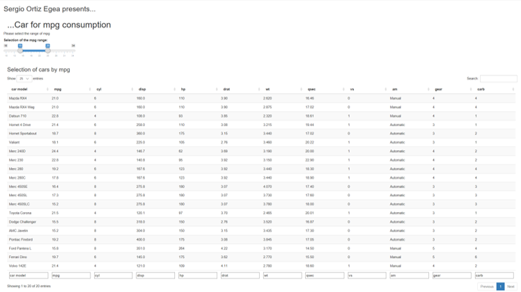

reproducible pitch presentation
========================================================
author: Sergio Ortiz Egea
date: 08/12/2016
autosize: true

Introduction
========================================================

The application has been programmed using Shiny a web application 
framework for R studio.

-The main goal of the project was to develop an interacting  application that uses the data provided by R (mtcars) for preseenting a list of the cars in within a specified range of miles per gallon.

-The developed application allows to see a list of cars and some key features, just selecting a range og miles per gallon (mpg) consumption.

How to operate
========================================================

- Move the indicators of the slide bar for selecting a mpg range

- The table will show the car models and their main features within the specified range



Slide With Code 
========================================================


```r
library(shiny)

data_mtcars <- mtcars;
data_mtcars <- cbind(rownames(mtcars),data_mtcars)
colnames(data_mtcars)[1] <- "car model"
data_mtcars[c(3,9:12)] <-as.data.frame(lapply(data_mtcars[c(3,9:12)],as.factor))
levels(data_mtcars$am) <- c('Automatic','Manual')
```

Selected Data
========================================================


Where to find the code?
========================================================

The code, documentation and presentations canbe found at:

https://github.com/SergioOrtizEgea/Developing-Data-Products-
